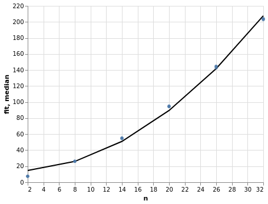

# LLVM XRay Tools

This is a project that gathers useful scripts and used for analysing exacutables
instrumented with the [`llvm-xray`](https://llvm.org/docs/XRay.html) project.
In particular, it is a playground to address where inefficiencies are coming by
computing stuffs from the traces (i.e. computational complexity).

## Installation and Setup

You may install and _modify_ these scripts by cloing this repository and
installing it into your python environment:

```bash
git clone git@github.com:SoilRos/llvm-xray-tools.git
pip install -e llvm-xray-tools
```

Now, the `llvm-xray-tools` command may be reached from the terminal:

```
llvm-xray-tools --help
```

Then, you want to make sure that the it is able to reach the extraction
tools provided by `llvm`. To do so, install the `llvm-tools` and give the
desired `llvm-xray` executable to the `XRAY_EXECUTABLE` environment variable.
This may vary from system to system. For instance, in debian, it would look like
this:

```bash
# for Debian
apt-get install llvm-9-tools
export XRAY_EXECUTABLE="llvm-xray-9"
```

## XRay Instrumentation

_**Caveat:** instrumentation doesn't work on MacOS_


XRay is a open source Google project that instrument event logs on entry and
exit of functions. It may be used in production and be activated at any time
during run time with relativetely low overhead.


### Clang

To enable instrumentation, you should add the respective xray flags:

| Flag                                  | Description                                                                |
| ------------------------------------- | -------------------------------------------------------------------------- |
| `-fxray-instrument`                   | Enable XRay instrumentation                                                |
| `-fxray-instruction-threshold=50`     | It controls how big (instructions) a function should be to be instrumented |
| `-fxray-ignore-loops`                 | If present, loops are not considered whether to instrument a function      |
| `-fxray-attr-list=xray-options.ini`   | External source for instrumentation options                                |

No additional flags are required (e.g. `-g`, `-O2`, `-fno-omit-frame-pointer`).
A minimal example would be:

```bash
clang++ -fxray-instrument -O3 my_prgram.cc -o my_program
```

See more in [XRay documentation](https://llvm.org/docs/XRay.html).

## Complexity Estimation

In order to estimate the complexity of the instrumented functions, you should
provide different inputs to the program that scale with respect to it as well as
how they should relate to the growth `n` that you want to measure.

For instance, lets say that `my_program` receives a text file with the
information to run, and that you have prepared multiple inputs for each case you
want to test (e.g. `test_2.txt`, `test_8.txt`, `test_14.txt`, ..., `test_32.txt`).

In that case, you may provide the `llvm-xray-tools` with the program to be
executed:

```bash
llvm-xray-tools big_o --repeat 3 ./my_program test_2.txt test_8.txt test_14.txt ... test_32.txt

1780             Cubic: time = 0.0014 + 7.4E-08*n^3 (sec)
944               Quadratic: time = 2.7 + 0.036*n^2 (sec)
3850       Quadratic: time = -0.00054 + 3.1E-05*n^2 (sec)
3665    Linearithmic: time = 0.048 + 0.0047*n*log(n) (...
1125            Linear: time = -6.4E-06 + 0.00023*n (sec)

...

941                        Constant: time = 1.2E-05 (sec)
979                        Constant: time = 6.2E-06 (sec)
```

This will run the program 3 times (i.e. `--repeat 3`) for each input and produce
the complexity estimation for each function id. Notice that in this case, the
growth variable `n` is deduced by each input (i.e. `2,8,14,...,32`), however, they
may be provided using the `--n_list` argument (e.g. `--n_list 2,8,14,...,32`).

Additionally, you may add the `--plot-dir <dir>` option to save the time graphs
for each function id.



## Function symbolization

To symbolize the function ids you can simply use the `llvm-xray` executable for
it:

```bash
llvm-xray extract my_program --symbolize
```

If you need only one function id, grepping usually does the job. No need for
complicated things here:

```bash
llvm-xray extract my_program --symbolize | grep "id: 1,"
- { id: 1, address: 0x0000000001FEF530, function: 0x0000000001FEF530, kind: function-enter, always-instrument: false, function-name: main, version: 2 }
- { id: 1, address: 0x0000000001FF0F96, function: 0x0000000001FEF530, kind: function-exit, always-instrument: false, function-name: main, version: 2 }
```

In heavily template programs, even reading a single function is hassle because
of the lenght of its signature. If you are suffering for that, use `camomilla`,
which _tries_ to collapse inner template arguments to make text more readable

```bash
pip install camomilla
llvm-xray extract my_program --symbolize | grep "id: <function_id>," | camomilla
```

## FAQ

> Why to use another tool if llvm already provides the `llvm-xray` executable.

The `llvm-xray` is fast and very useful to convert information from the binary
and from the events generated by the instrumentation, however, an scripting
language like python is much more suitable to explore the resulting data sets.
Modifying python scripts to your needs takes few minutes, while writing and
recompiling the `llvm-xray` executable is more cumbersome for such an
interactive procedure.

> Why the results are not symbolized by default.

Because many C++ libraries use a fair amount of templates symbols are usually
quite big. Early symbolization usually produce a large amount of unamangable
data (e.g. converting a fair amount of symbolized traces to the `trace_event`
format causes Google Chrome to not be able to load the data). Thus,
symbolization is left to the very end. That is, when _you_ are ready with your
tracing analysis.

> I implemented a script that might be useful to others

Create a Merge Request, I will be happy to check it out!
